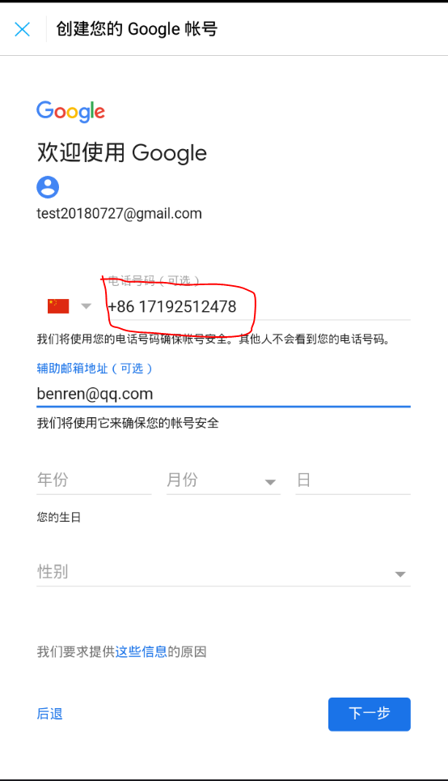

# 解决注册谷歌账号时出现的错误：此电话号码无法用于进行验证

最近手贱将以前注册的谷歌账号给删除了，而在重新注册账号时由于第三方邮箱的操作不友好，在输入验证码后按了个返回，导致现在的手机号无法注册，并提示 `此电话号码无法用于进行验证` ，在网上搜索了好多方法都不行，什么挂VPN、QQ邮箱等都不行，最后想了一上午终于想出来了一个可行的方法，并测试已成功申请且绑定自己的手机号。

使用该方法注册账号，你需要

* 支付一定的费用，需首次充值10元，但充值完后可注册100个账号
* 不需要使用VPN，使用网易邮箱大师即可

## 准备阶段

电脑和手机端同时操作，手机上需要下载APP。

1. 首先在手机上下载 **网易邮箱大师**，或者部分手机自带的邮箱APP，只要不出现 `暂时无法注册账号` 的错误就行，经测试 **QQ邮箱** 是不行的。
2. 在[易码平台](http://www.51ym.me/ '易码平台')（其他短信接受平台也行，不过我没去测试）注册账号，并充值。

    该平台用于专门生成一个手机号码，并用于接收短信验证码，充值最低要10块钱，没办法，要想注册账号，掏点钱就掏吧。

## 开始注册

完成准备阶段，那就开始注册吧。

1. 打开 **网易邮箱大师**，随便输入个gmail的邮箱，然后点下一步。

    

2. 点击创建账号，并填写个人信息以及邮箱名等信息，并点击下一步
   
   

3. 登录易码平台，点击获取验证码，选择短信项目为 **google**，运营商随意，然后点击 **获取手机号**，会生成一个手机号码。

    

4. 将易码平台给的号码输入到手机上，并点击下一步，若没有问题，则会向该手机号码发一条短信，并可以在译码平台上看到验证码如下所示，在手机上输入该验证码，并点下一步。

    

    `注意`：若出现 **无法用于注册** 错误，则在易码平台上点击释放手机号，并重新获取手机号，这样多试几个（一般不超过5个），若尝试多次还不行，那说明你当前注册的邮箱账号已经不能注册了，只能换一个邮箱账号注册。

5. 填写完验证码点下一步，会出现如下界面，需要填写辅助电话号码和辅助邮箱，虽然是可选的，`但是`，该辅助电话号码和邮箱就是跟账号绑定的手机和邮箱啊，**此处填写的手机号就是以后用于验证的手机号，此处非常关键，填写你需要绑定的手机号** ，填完点下一步。

    

6. 接下来应该会让你验证辅助的手机号码，忘截图了，不过此时可以正常收到短信，接着一路下一步，完成注册吧。

易码平台只有收到短信才收取1毛钱，但首充要10块，不过10块买个账号也划算，毕竟还能接着注册近100个账号。好了，今天就到这里吧。