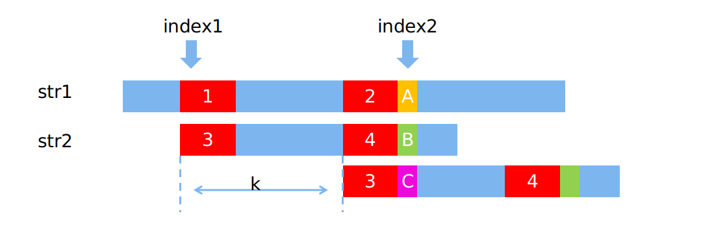
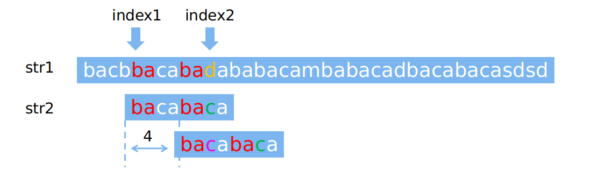

<!-- TOC -->

- [说明](#说明)
- [kmp 算法思想](#kmp-算法思想)
- [next 数组计算](#next-数组计算)
- [字符串匹配](#字符串匹配)
- [参考资料](#参考资料)

<!-- /TOC -->

## 说明

&emsp;&emsp;kmp 算法是由 Knuth、Morris 和 Pratt 三人设计的一个非常高效的字符串匹配算法。该算法用于判断一个字符串是否包含于另一个字符串中。该算法复杂度是 $O(m + n)$，其中 $m$ 和 $n$ 分别是两个字符串的长度。

## kmp 算法思想

&emsp;&emsp;我们能很容易想到 $O(M * N)$ 复杂度的算法，即索引从字符串 str1 的第一个字符开始，依次检查以该字符作为首字符的连续 N 个字符是否与字符串 str2 匹配，若不匹配，则索引向前移动一位，从第二个字符开始依次检查，以此类推。

&emsp;&emsp;该算法并没有考虑到现已匹配的部分字符串的结构。已匹配的部分字符串中可能包含相同的部分，若利用这些相同的部分，我们可以一次性移动多位而不只是移动一位，这样大大提高了算法的效率。

&emsp;&emsp;假设现有两个字符串 str1 和 str2，并且现已从 index1 处开始检是否匹配。当我们检测到 index2 处时，发现此时待检测的两个字符不相同（即图中 A 和 B 部分字符不匹配，index2 和 index1 之间的字符均匹配），按照传统思想我们将会从 index1 + 1 处的位置开始新一轮的检测，这样检测的效率极低。当我们仔细观察现已匹配的部分字符串时，若能找到字符串中首尾相同的部分（即图中 1、2、3和4部分的字符串相同），则可以直接将 str2 向前移动 k 个位置（如图所示），即图中 2 和 4 部分将作为新匹配字符串的头部，并接着从 str1 的 index2 位置开始检测。若不含有相同的部分，此时不管是将 str2 向前移动多少位都不会出现匹配的字符串，因此，可以从 str1 的 index2 位置开始新的一轮检测（即从 str2 的第一个字符开始匹配，可以理解为将 str2 向前移动了 str2 长度的位置）。

<div align="center"></div>

&emsp;&emsp;现有如下两个字符串：

```cpp
    const char *str1 = "bacbbacabadababacambabacadbacabacasdsd";
    const char *str2 = "bacabaca";
```

&emsp;&emsp;按照上述的匹配过程可以得到如下的匹配过程图，当匹配到 index2 处时，发现字符 d 和 字符 c 不匹配，但已匹配的部分 `bacaba` 的首位相同的部分为 `ba`，该部分为字符串 `bacaba` 的最长的相同前缀和后缀，而在下一轮的匹配过程中，将 `ba` 部分作为新的首部，并接着 index2 处开始匹配。一次类推完成整个字符串的匹配过程。

<div align="center"></div>

&emsp;&emsp;由以上匹配过程可知，每当开始新一轮的匹配时，我们需要知道当前已匹配的字符串中最长相同前缀和后缀的长度，以实现匹配过程中的快速跳转。而当前已匹配的字符串长度可能为 1 ～ length(str2)，因此，我们可以创建一个长度为 n 的数组 ( n = length(str2) )，用来保存不同长度字符串的最长相同前缀和后缀的长度。该数组为 next 数组。

## next 数组计算

&emsp;&emsp;next 数组中第 i 个数表示字符串索引从 0 到 i 的字符串最长相同前缀和后缀的长度。`注意，前缀和后缀不包括字符串本身，比如 aaaa 相同的最长前缀和最长后缀是 aaa` 。  
&emsp;&emsp;假设我们现在已经求得 next[0]、next[1]、…… next[ i-1 ]，分别表示长度为 1 到 i 的字符串的最长相同前缀和后缀的长度。现在要求 next[ i ]。由下图我们可以看到，如果位置 i 和位置 next[ i-1 ] 处的两个字符相同（下标从零开始），则 next[ i ]等于 next[ i-1 ] + 1。

<div align="center"></div>

&emsp;&emsp;如果两个位置的字符不相同，我们可以将长度为 next[ i-1 ] 的字符串继续分割，获得其最大公共长度 next[ next[ i-1 ] -1 ]，然后再和位置 i 的字符比较。由于长度为 next[ i-1 ] 的字符串的公共长度保存在索引为 next[ i-1 ] -1 的 next 数组中，而该字符串又包含相同的前缀和后缀，如下图所示，如果位置 next[ next[ i-1 ] -1 ]和位置 i 的字符相同，则 next [i ]就等于 next[ next[ i -1 ] -1 ] + 1。如果不相等，就可以继续分割长度为 next[ next[ i -1 ] -1 ] 的字符串，直到字符串长度为 0 为止。

<div align="center"></div>

&emsp;&emsp;根据上述计算 next 数组的过程，可以写出相应的求 next 数组的代码（CPP实现）：

```cpp
vector<int> getNext(const char *str)
{
    int len = strlen(str);               // 字符串长度
    vector<int> next(len, 0);            // 保存结果，next[0]=0
    for(int i = 1; i < len; i++)
    {
        int k = next[i - 1];             // k 表示需要比较的位置，初始值为 next[i - 1]
        while(k > 0 && str[i] != str[k]) // 比较，若不相等则继续分割，直到相等或为0(即不含相同部分)
            k = next[k - 1];
        if(str[i] == str[k])             // 若相等，则 next[i] = k + 1，否则为0，其中 k 为索引
            k++;
        next[i] = k;                     // 更新 next[i]
    }
    return next;
}
```

&emsp;&emsp;在求解 next 数组后，可以利用该数组进行字符串匹配。

## 字符串匹配

&emsp;&emsp;假若当前字符串 str1 的第 i 个字符正在与字符串 str2 的第 k 个字符进行匹配（i 和 k 均从 0 开始），若相等，则进行下一轮的匹配，即进行 str1 的 第 i+1 个字符与 str2 的第 k+1 个字符匹配；若不相等，则跟 str2 的第 next[k - 1] 字符进行匹配，直到 k = 0 为止。重复以上过程直到检测完 str1 的所有字符。

&emsp;&emsp;根据上述匹配过程，完成 CPP 代码：

```cpp
int search(const char *str1, const char *str2)
{
    vector<int> next = getNext(str2);           // 获得 str2 的 next 数组
    int k = 0;                                  // 记录当前已匹配 str2 的索引
    int res = -1;                               // 保存匹配的字符串起始位置，若不存在，返回-1
    for(int i = 0; i < (int)strlen(str1); i++)  // 第 i 轮匹配
    {
        while(k > 0 && str1[i] != str2[k])      // str1的第i个与str2的第k个字符进行比较，若不同，则k=next[k-1]，直到k为0或相等为止
            k = next[k - 1];
        if(str1[i] == str2[k])                  // 若相等，更新k
            k++;
        if(k == (int)strlen(str2))              // 若找到完全匹配
        {
            res = i - k + 1;                    // 保存匹配的字符串起始位置，此时根据需要可用容器保存多个结果
            k = next[k - 1];                    // 进行下一轮匹配，此处根据需要可去掉
        }
    }
    return res;
}
```

&emsp;&emsp;以上就是 KMP 算法的整个过程，完整的代码可访问 [Github](https://github.com/leitmily/Notes/tree/master/algorithm/KMP "KMP 算法详解（CPP 实现）") 下载。

## 参考资料

* [KMP算法学习(详解)](https://www.cnblogs.com/ECJTUACM-873284962/p/6751457.html "KMP算法学习(详解)")
* [KMP算法最浅显理解 —— 一看就明白](https://blog.csdn.net/starstar1992/article/details/54913261/ "KMP算法最浅显理解——一看就明白")